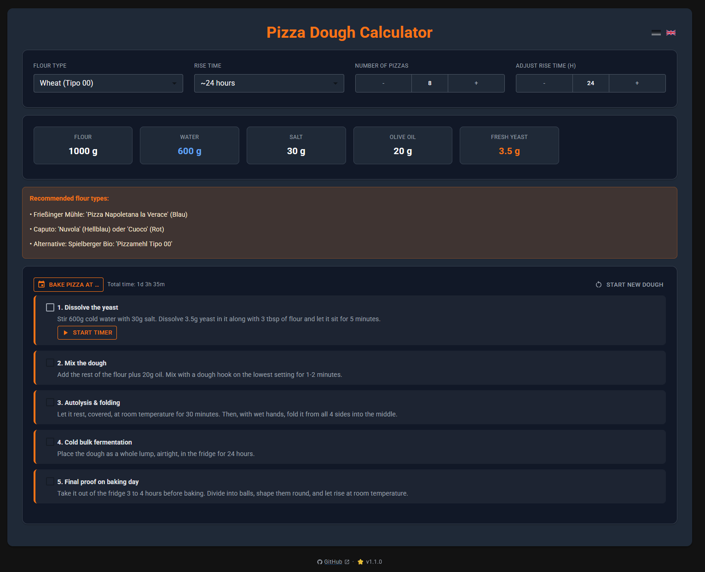

# Pizza dough calculator

_[English](README.md) | [Deutsch](README.de.md)_

A pizza dough calculator for different flour types and rise times. Calculates the amounts of flour, water, salt, oil and yeast, and shows the matching preparation steps.
The recipies are based on various recipies I tried and are a combination of what works best for me.

**[You can try the app here: ](https://justsomebody42.github.io/Pizza-Dough-Calculator/)**

## Features

- Wheat, spelt and gluten-free dough
- Rise times from a quick 2-3 hour express dough up to a 72-hour cold ferment
- Scales all ingredient amounts to any number of pizzas
- Step-by-step preparation instructions for the selected recipe, with checkboxes to track your progress
- Live countdown timers for rise/rest steps, with a "ready at" clock time and a browser notification when a step is done
- Adjust the long rise/ferment time up or down (e.g. 65h instead of 72h) to fit your schedule
- Pick a target time to bake, and the app tells you when to start the dough and counts down to it
- "Start new dough" resets your progress for the current recipe (with a confirmation dialog)
- Available in German and English (auto-detected from your browser, switchable in the app)
- Installable as a Progressive Web App (PWA) with offline support
- Remembers your last settings, step progress and scheduled bake time per recipe in your browser

## AI disclaimer

AI tools were used to assist during the development.

## License

Licensed under the [PolyForm Noncommercial License 1.0.0](LICENSE). You're free to use, modify, and share this project for noncommercial purposes (personal, educational, hobby, etc.). Commercial use requires a separate agreement.
